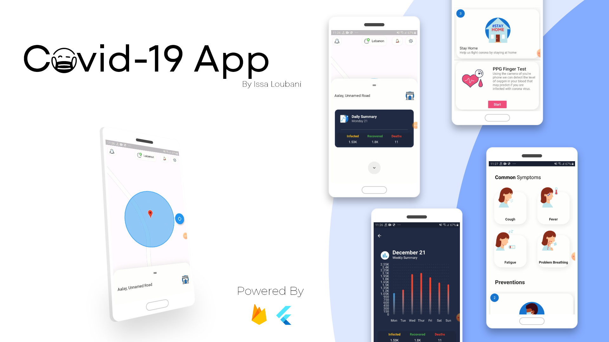

# Covy (Covid-19 App) in Flutter

## About

A covid-19 app capable of providing user by information regarding the latest covid-19 cases (currently support lebanon) and his location, as well as providing a test to indicate if the user has covid-19 (still in beta).

## Demo

https://user-images.githubusercontent.com/30502655/148705699-ae91ea5e-6754-48ad-afbc-1f0668209c54.mp4

https://user-images.githubusercontent.com/30502655/148706013-5693fd72-1ce4-4fa0-b1f0-8cae17f4e773.mp4

## Features

The app currently support:

- [x] Show User Location
- [x] Show latest covid cases in the current day (Only Lebanon is supported at the moment)
- [x] Show summary of all covid cases in the week
- [x] Give Tips about preventions and symptoms
- [x] Language localization (Currently only Arabic is supported)
- [x] Dark Mode
- [x] Chatbot to know latest info about covid
- [x] Measuring User's oxygen level and heart rate as a test for covid

## Motivation

I built this app as a way to showcase my skills in flutter as well as helping others throughout these dire times through technology. The major feature I want to built is a way to test if the user truly has covid-19 through mobile phones, the oxygen level is used to indicate if the user has abnormal oxygen level and notify nearset hospital.

## Future Updates

- [ ] Notify the user if his oxygen level is abnormal
- [ ] Show the user the nearst hospital in case of abnormal oxygen level
- [ ] Notify the user of covid cases on map (Not done since no API is available with the location of the case of covid-19)
- [ ] Notify the user to keep distance about 1 meter from others for achieving social distancing
